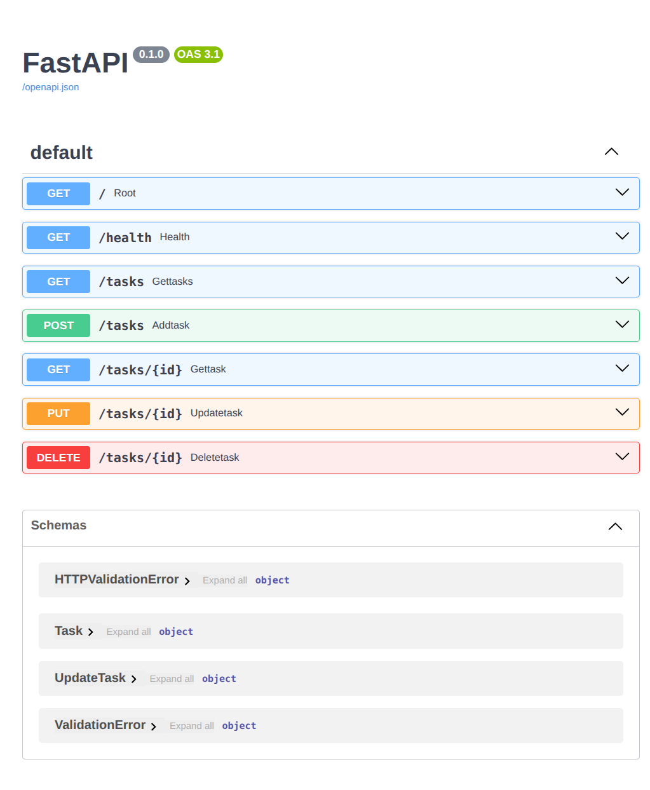

# Task API

This is a small FastAPI task tracker. It exposes a handful of CRUD endpoints for working with an in-memory list of tasks, plus a health check and a root metadata route.

## Install & Run

```bash
python -m venv .venv && source .venv/bin/activate && pip install fastapi uvicorn pydantic && uvicorn main:app --host 127.0.0.1 --port 8000
```

## Endpoints

| Method | Path | Description |
| --- | --- | --- |
| GET | `/` | Returns API metadata and the list of documented endpoints. |
| GET | `/health` | Returns a simple health status payload. |
| GET | `/tasks` | Returns all tasks. |
| GET | `/tasks/{id}` | Returns one task by id or `404` if it does not exist. |
| POST | `/tasks` | Creates a new task from JSON like `{"title":"Buy milk"}`. |
| PUT | `/tasks/{id}` | Updates an existing task's `title` and/or `done` fields. |
| DELETE | `/tasks/{id}` | Deletes a task by id. |

## Example `curl -i`

```bash
HTTP/1.1 201 Created
date: Thu, 16 Jul 2026 12:04:59 GMT
server: uvicorn
content-length: 40
content-type: application/json

{"id":4,"title":"Buy milk","done":false}
```

## Swagger Screenshot




## AI VS me

```md
Build a simple tasks CRUD API app using fastapi. 
The app requirements:
The app should use in memory list for the tasks, and write a simple three tasks for testing, hardcoded
Tasks should have three values, Id, name, done 
App endpoints:
1.the root endpoint return "Hello server"
2./health return "status":"server is running"
3.GET /tasks which return all tasks,
4. GET /tasks/id return a task with specifid id and an error "Task {id} doesn't exists", 404 code status
5.POST /tasks to create a new task with only sending the title, and automatically add the next id and done as false return 201 created. Validate the request not to be empty title and return a bad request if it is with 400 Bad request with error message
6.PUT /tasks/id to update title and done status of the task, should update either one or both. valide the request to have valide inputs. with 400 return if empty and 404 if unknown id
7.DELETE /tasks/id removes a task with specified id, 204 on success and 404 for unkown id. 
Add function description for swagger ui 
```

## What did AI do better ? 
1. Ai used classes for all the tasks, Body Requests, and response request for better serilization and abbility to work with data.

2. Ai added detailed descriptions for the swagger-ui in the classes and the functions.

3. Ai specified all the return types for the functions, and seperated the success returns in the functions and the error ones raising Http exception which improves the code readability and testability. 